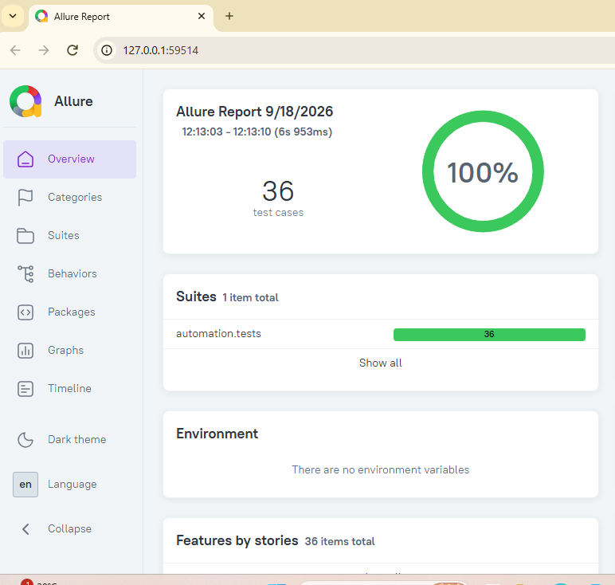

# Online Exam & Test Series — QA Automation

ExamPro is a conceptual QA automation portfolio project representing an online examination and test-series platform.

## QA Coverage

- Manual test strategy and test cases
- Playwright UI automation
- Python + Pytest
- API testing
- Database validation
- Authentication and authorization
- Exam timer and auto-submit
- Result/scoring validation
- Subscription/access control
- Cross-browser and responsive testing
- CI/CD with GitHub Actions
- Allure reporting

## Documentation

- [Requirements](docs/requirements.md)
- [Test Strategy](docs/ExamPro_Test_Strategy.xlsx)
- [Test Cases](docs/ExamPro_Test_Cases.xlsx)

## 📊 Allure Test Report

Allure Report is used to provide detailed visibility into automated test execution.

### Test Execution Results

- **36 test cases executed**
- **36 passed**
- **0 failed**
- **100% pass rate**
- **Execution time:** ~7 seconds
- **Framework:** Python + Pytest
- **Reporting:** Allure

**Allure Test Report**
