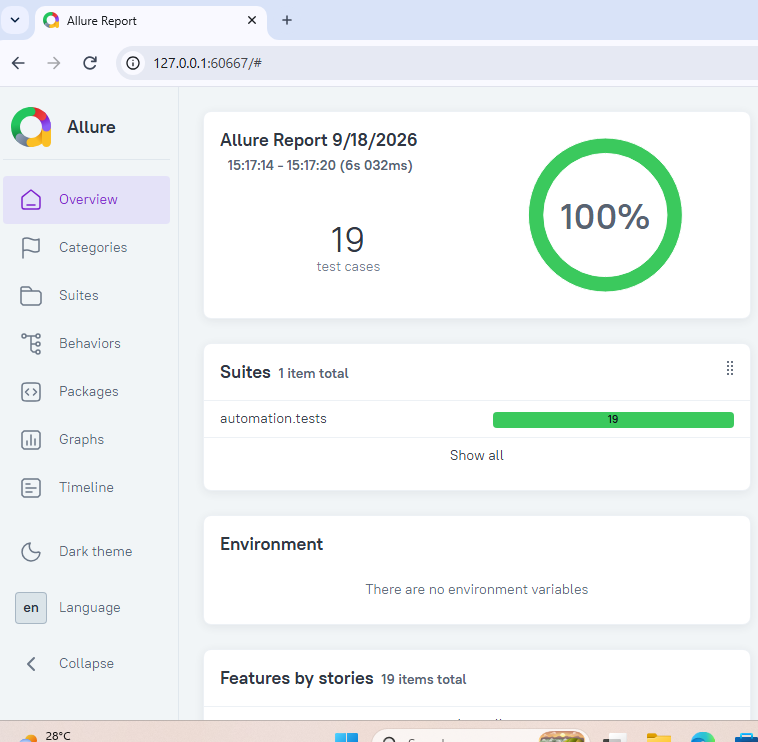

# Digital Library API Testing — REST API Automation

A Python-based API automation project for testing a Digital Library backend.  
The project validates Books, Members, and Borrow/Return workflows through automated REST API tests with database validation.

## 🎯 Project Objective

The goal of this project is to validate the functional behavior, negative scenarios, business rules, and database state of a Digital Library API.

The automation suite verifies both:

- API response behavior
- Backend database state after API operations

---

## 🧪 QA Coverage

### Books API

- Create book
- Get book by ID
- Update book
- Delete book
- Duplicate ISBN validation
- Invalid book ID validation
- Database validation after create/update/delete

### Members API

- Create member
- Get member by ID
- Duplicate email validation
- Invalid member ID validation
- Database validation

### Borrow & Return API

- Borrow a book
- Return a book
- Invalid book validation
- Invalid member validation
- Prevent borrowing an already borrowed book
- Prevent returning an already returned book
- Invalid borrow ID validation
- Database validation of borrow/return status
- Book availability validation

### API Validation

- HTTP status code validation
- JSON response validation
- Success and error response validation
- Negative API testing
- Business-rule validation

### Database Validation

- SQLite database validation
- Verify created records
- Verify updated records
- Verify deleted records
- Verify borrow records
- Verify book availability state

---

## 🛠️ Tech Stack

| Technology | Usage |
|---|---|
| Python | Automation language |
| Pytest | Test framework |
| HTTPX | API requests |
| FastAPI | Backend application |
| SQLite | Database |
| Allure | Test reporting |
| Git | Version control |
| GitHub | Source code management |

---

## 📁 Project Structure

```text
02-digital-library-api-testing/
│
├── app/
│   ├── backend/
│   │   ├── books.py
│   │   ├── borrow.py
│   │   ├── main.py
│   │   └── members.py
│   │
│   └── database/
│       ├── init_db.py
│       ├── library.db
│       └── schema.sql
│
├── automation/
│   ├── api/
│   │   ├── books_api.py
│   │   ├── borrow_api.py
│   │   └── members_api.py
│   │
│   ├── fixtures/
│   │   └── api_fixtures.py
│   │
│   ├── tests/
│   │   ├── test_books_api.py
│   │   ├── test_borrow_api.py
│   │   └── test_members_api.py
│   │
│   ├── utils/
│   │   └── db_utils.py
│   │
│   └── config.py
│
├── conftest.py
├── README.md
└── .gitignore
```

---

## ⚙️ Test Architecture

The project follows a layered API automation approach:

```text
Test Cases
    │
    ▼
Pytest Test Layer
    │
    ▼
API Client Layer
    │
    ▼
REST API
    │
    ▼
FastAPI Backend
    │
    ▼
SQLite Database
    │
    ▼
Database Validation
```

This approach allows the tests to validate both the API response and the resulting backend database state.

---

## 🚀 How to Run

### 1. Activate the virtual environment

```powershell
.venv\Scripts\Activate.ps1
```

### 2. Start the backend

From the project directory:

```powershell
python -m uvicorn app.backend.main:app --reload
```

The API runs locally on:

```text
http://127.0.0.1:8000
```

### 3. Run the automated tests

Open another terminal in the project directory:

```powershell
pytest -v
```

---

## 📊 Test Execution Results

The current automated test execution contains **19 test cases**.

```text
19 passed in 5.88s
```

### Test Distribution

| Module | Tests |
|---|---:|
| Books API | 8 |
| Borrow & Return API | 7 |
| Members API | 4 |
| **Total** | **19** |

### Result

- **19 tests executed**
- **19 passed**
- **0 failed**
- **100% pass rate**

---

## 📈 Allure Test Report

Allure is used to provide detailed visibility into automated test execution.



---

## 🔍 Example Scenarios

### Duplicate ISBN

The automation creates a book and attempts to create another book using the same ISBN.

Expected result:

```text
HTTP 409
Book with this ISBN already exists
```

### Borrowing an Already Borrowed Book

The automation verifies that a book cannot be borrowed by another member while it is already borrowed.

Expected result:

```text
HTTP 409
Book is already borrowed
```

### Return Validation

The automation verifies:

```text
Borrowed → Returned
```

and validates that the database reflects:

- Return timestamp
- Returned status
- Book availability restored

---

## 🧩 Key QA Practices Demonstrated

- API functional testing
- Positive testing
- Negative testing
- Error scenario validation
- Business-rule testing
- Response validation
- Database validation
- API workflow validation
- Reusable API client classes
- Pytest fixtures
- Unique test data generation using UUIDs
- Automated regression execution
- Test reporting with Allure

---

## 📌 Future Enhancements

- Add API schema validation
- Add more parameterized test scenarios
- Add authentication/authorization coverage
- Add CI/CD execution with GitHub Actions
- Add API performance checks
- Expand database integrity validation
- Add automated test execution across environments

---

## 👩‍💻 Skills Demonstrated

**Python | Pytest | REST API Testing | HTTPX | FastAPI | SQLite | Database Testing | Negative Testing | Business Rule Validation | Allure | Git | GitHub**

