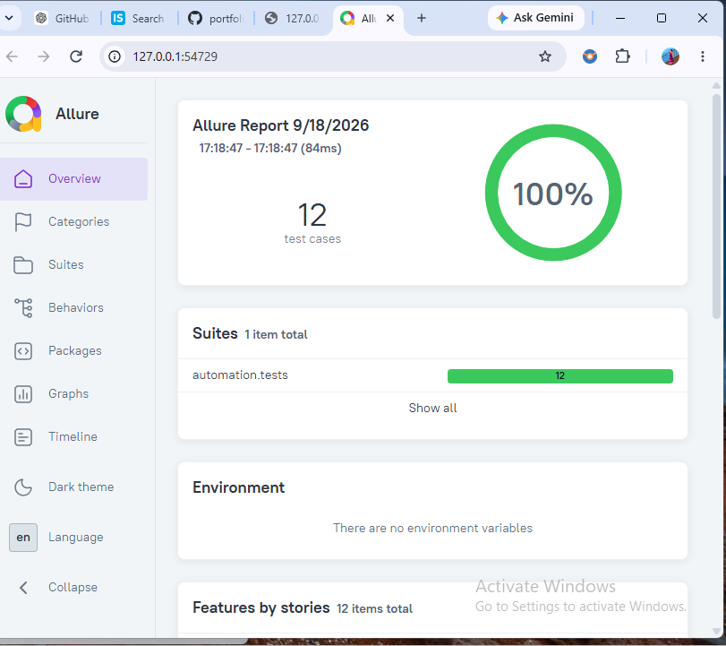

# Quiz Practice API – API Automation & CI/CD

A backend API testing project built with **FastAPI, SQLite, Python, Pytest, Requests, and GitHub Actions**.

This project demonstrates REST API validation, database-backed API behavior, automated API testing, and continuous integration using GitHub Actions.

---

## 🎯 Project Objective

The goal of this project is to build and automate testing for a quiz management REST API.

The automation validates:

- Quiz creation
- Quiz retrieval
- Quiz retrieval by ID
- Invalid quiz handling
- Question creation
- Invalid quiz handling while creating questions
- Question retrieval
- Quiz attempt submission
- HTTP status codes
- JSON response structure
- Response data validation
- Database initialization
- Automated CI execution

---

## 🛠️ Tech Stack

| Technology | Purpose |
|---|---|
| Python 3.13 | Programming language |
| FastAPI | Backend REST API |
| SQLite | Database |
| Pytest | Test framework |
| Requests | API automation |
| Git | Version control |
| GitHub Actions | CI/CD automation |
| Allure | Test reporting |

---

## 📁 Project Structure

```text
03-quiz-practice-ci-cd/
│
├── app/
│   ├── backend/
│   │   └── main.py
│   │
│   └── database/
│       ├── init_db.py
│       └── schema.sql
│
├── automation/
│   ├── api/
│   │   └── quizzes_api.py
│   │
│   ├── fixtures/
│   │   └── api_fixtures.py
│   │
│   ├── tests/
│   │   └── test_quizzes_api.py
│   │
│   └── config.py
│
├── screenshot/
│   └── AllureP3.png
│
├── .gitignore
├── conftest.py
├── requirements.txt
└── README.md
```

---

## 🔌 API Coverage

### Quiz APIs

| Method | Endpoint | Purpose |
|---|---|---|
| POST | `/api/quizzes` | Create a quiz |
| GET | `/api/quizzes` | Get all quizzes |
| GET | `/api/quizzes/{quiz_id}` | Get quiz by ID |

### Question APIs

| Method | Endpoint | Purpose |
|---|---|---|
| POST | `/api/quizzes/{quiz_id}/questions` | Create a question |
| GET | `/api/quizzes/{quiz_id}/questions` | Get quiz questions |

### Attempt API

| Method | Endpoint | Purpose |
|---|---|---|
| POST | `/api/quizzes/{quiz_id}/attempt` | Submit a quiz attempt |

---

## 🧪 QA Coverage

### Quiz Testing

- Create quiz
- Retrieve all quizzes
- Retrieve quiz by ID
- Validate invalid quiz scenarios

### Question Testing

- Create question
- Validate question creation for an invalid quiz
- Retrieve quiz questions
- Validate invalid quiz scenarios

### Quiz Attempt Testing

- Submit quiz attempt with correct answer
- Submit quiz attempt with wrong answer
- Validate invalid quiz scenario
- Validate invalid question scenario
- Validate API response
- Validate response data

### API Validation

- HTTP status code validation
- JSON response structure validation
- Response data validation
- Positive API testing
- Negative API testing

---

## 🔄 CI/CD

The project uses **GitHub Actions** to automate API test execution.

The CI workflow is designed to:

1. Set up the Python environment
2. Install project dependencies
3. Prepare the application
4. Run the Pytest test suite
5. Report the test execution result

This demonstrates automated test execution as part of a CI/CD workflow.

---

## 🏗️ Test Architecture

```text
Pytest Tests
     │
     ▼
API Client
     │
     ▼
REST API
     │
     ▼
FastAPI Backend
     │
     ▼
SQLite Database
```

The automation separates test cases from API interaction logic using reusable API client and fixture components.

---

## 🚀 How to Run Locally

### 1. Activate the virtual environment

```powershell
.venv\Scripts\Activate.ps1
```

### 2. Install dependencies

```powershell
pip install -r requirements.txt
```

### 3. Start the backend

```powershell
python -m uvicorn app.backend.main:app --reload
```

The API runs locally on:

```text
http://127.0.0.1:8000
```

### 4. Run the tests

Open another terminal:

```powershell
pytest -v
```

### 5. Generate Allure results

```powershell
pytest --alluredir=allure-results
```

### 6. Generate and open the Allure report

```powershell
allure generate allure-results -o allure-report --clean
allure open allure-report
```

---

## 📊 Test Execution Results

The current automated test suite contains **12 test cases**.

```text
12 passed in 0.10s
```

### Result

- **12 tests executed**
- **12 passed**
- **0 failed**
- **100% pass rate**

---

## 📈 Allure Test Report

Allure is used to provide visual reporting of automated test execution.



---

## 🔍 Example Test Scenarios

### Create Quiz

The automation validates quiz creation through the REST API.

Expected:

```text
HTTP 201
Quiz created successfully
```

### Invalid Quiz

The automation validates requests using an invalid quiz ID.

Expected:

```text
HTTP 404
Quiz not found
```

### Submit Quiz Attempt

The automation validates quiz submission using:

- Correct answer
- Wrong answer
- Invalid quiz
- Invalid question

---

## 🧩 Key QA Practices Demonstrated

- REST API testing
- API automation with Python
- Pytest test automation
- Positive testing
- Negative testing
- HTTP status code validation
- JSON response validation
- API workflow validation
- Reusable API client design
- Pytest fixtures
- Backend API testing
- SQLite-backed application testing
- CI/CD test execution
- GitHub Actions
- Allure test reporting

---

## 📌 Future Enhancements

- Add API schema validation
- Add database state validation
- Add more parameterized test cases
- Expand negative test coverage
- Add failure artifact collection
- Expand CI/CD reporting
- Add automated execution across environments

---

## 👩‍💻 Skills Demonstrated

**Python | Pytest | REST API Testing | Requests | FastAPI | SQLite | API Automation | Negative Testing | JSON Validation | Allure | Git | GitHub Actions | CI/CD**